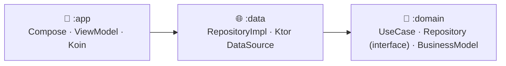
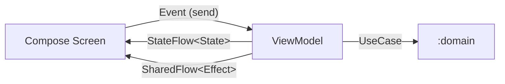

# Desafio Mercado Bitcoin

App Android do desafio **"Quero ser MB"**: consome a API pública da **CoinMarketCap** para listar exchanges de criptomoedas e permitir drill-down até os ativos negociados em cada corretora.

## Stack

- **UI**: Jetpack Compose + Material 3
- **DI**: Koin
- **Rede**: Ktor Client (engine OkHttp) + kotlinx.serialization
- **Concorrência**: Coroutines + Flow / StateFlow / SharedFlow
- **Imagens**: Coil
- **Testes**: JUnit 4 + MockK + Robolectric (JVM) + Espresso/Compose UI Test (instrumentados) + Konsist (arquitetura)

## Arquitetura

O projeto segue **Clean Architecture** em três módulos Gradle, com dependência apontando sempre para dentro:



| Módulo | Tipo | Responsabilidade |
|---|---|---|
| `:domain` | Kotlin puro | Entidades, interfaces de `Repository`, `UseCase`s, erros de domínio |
| `:data` | android-library | Implementações de `Repository`, DataSources Ktor, DTOs e mappers |
| `:app` | android-application | Compose, ViewModels, DI (Koin), navegação, recursos |

`:domain` não conhece Android SDK nem as camadas acima — a fronteira é reforçada mecanicamente (compilação) e estaticamente (Konsist).

## MVI na camada de apresentação

Cada tela em `:app` segue um ciclo unidirecional **Model-View-Intent**:



- **Event** — intenção do usuário, disparada via `viewModel.send(event)`.
- **State** — snapshot renderizável, exposto como `StateFlow`.
- **Effect** — eventos one-shot (snackbar, navegação), expostos como `SharedFlow`.

O ViewModel depende só de `UseCase`s e `ResourceProvider`, nunca de `Repository`/DataSource diretamente.

## Rodando o projeto

A chave da API da CoinMarketCap é opcional para compilar e rodar os testes — sua ausência só se manifesta em runtime como erro de rede.

```properties
# local.properties
cmc.api.key=SUA_CHAVE_AQUI
```

```bash
./gradlew :app:assembleDebug
```
